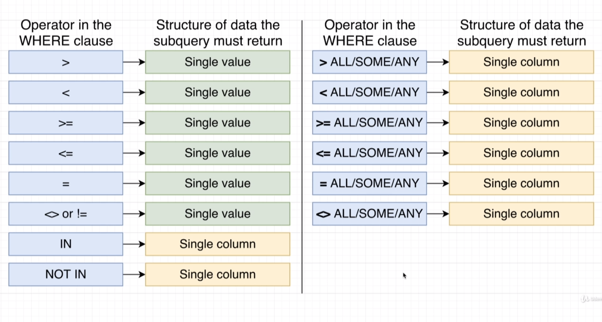

# Subquery

- adding subquery in select:

when we need to write two query we should compin them down into one by subquery

SELECT name, price
FROM products
WHERE price > (
SELECT MAX(price)
FROM products
WHERE department = 'Toys'  
);

if we need subquery in select in must return single value

SELECT name, price, (SELECT MAX(price) FROM products)
FROM products
WHERE privce > 876;

Another example:

SELECT name, price, (SELECT price FROM products WHERE id = 3;) AS id_3
FROM products
WHERE privce > 876;

SELECT name, price, price / (
SELECT MAX(price)
FROM phones
) AS price_ratio
FROM phones

- Adding subquery in From:

we must have an alias applied to it like:

FROM sub_query AS P

the alias is P

SELECT name, price_weight_ratio
FROM (
SELECT name, price / weight AS price_weight_ratio
FROM products
) AS p

WHERE price_weight_ratio > 5

SELECT \*
FROM (
SELECT MAX(price)
FROM products
) AS p

Why to use subquery inside FROM:

Find the average number of orders for all users:

to solve this we need to find the order table and take the users_id and add togather the same ids

then add the nubers togather and divide the total to the total number of orders

5 5 5 => 3 orders

1 1 => 2orders

3 => 1 order

4 => 1 order

(3 + 2 +1 +1 ) / 4 =

1.75 order per user

SELECT AVG(order_count)
FROM (
SELECT user_id, COUNT(\*) AS order_count
FROM orders
GROUP BY user_id) AS p

by this query we find the avrage of orders for each user

- useig subquery inside join:

the data returned from subquery should be compatible with ON cluse

SELECT first_name
FROM users
JOIN (
SELECT user_id
FROM orders
WHERE product_id = 3
) AS o
ON o.user_id = users.id

this query return the name of all users how order product id = 3

- subquery inside where:

used a lot:

SELECT id 
FROM orders
WHERE products_id IN 
(
    SELECT id
    FROM products
    WHERE price / weight > 5

)

ther returned data from subquery changes depending on the comparison operator: IN 

comparison operator with the subquery:

select name, price
FROM phones
WHERE price > 
(
  SELECT price 
FROM phones 
WHERE name = 'S5620 Monte'

)

<!-- another example -->

SELECT name, department
FROM products
WHERE department NOT IN (
  SELECT  department 
FROM products
WHERE price < 100
  )

  <!-- greater all -->

  SELECT name, department, price
FROM products
WHERE price > ALL (
  
  SELECT  price 
FROM products
WHERE department = 'Industrial'
  
  )

select here price greater than all of the price in Industrial department.

 
 <!-- some or any -->

 50 > SOME => (20,100)

at lest one value is greater then 50 

SELECT name, price
FROM products 
WHERE price > SOME (
  SELECT price 
FROM products 
WHERE department = 'Industrial'
  )

<!-- Example -->

show the name and price of the most expensive product in each department 

9 - 27