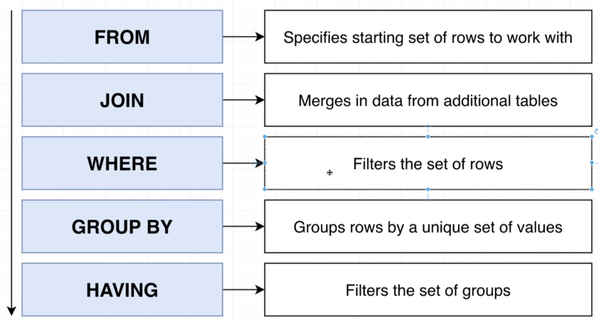

# Grouping

SELECT user_id 
FROM COMMENTS 
GROUP BY user_id

find the set of all unique user_id then tack each row and assign it to a group based on its user_id

first will create a groups based on user_id  and put the data rwo in the group that got the same id 

# Aggregates

Reduces many vaues down to one 

some of aggregates functions:

 * COUNT()

 * SUM()

 * AVG()

 * MIN()

 * MAX()

SELECT MAX(id)
FROM comments

# Aggregats and Group by

number of comment the user has made:

SELECT user_id, COUNT(id) AS num_comments_created
FROM COMMENTS 
GROUP BY user_id

count how many photos: 

SELECT COUNT(user_id) FROM photos

here null values are not counted 

- to incloude every thing:

SELECT COUNT(*) FROM photos

SELECT user_id, COUNT(*)
FROM COMMENTS 
GROUP BY user_id

- with join:

SELECT name, COUNT(*)
FROM books 
JOIN authors ON authors.id = books.author_id
GROUP BY authors.name

always use HAVING with GROUP BY

find the number of comments for each photo 
where 
the photo_id is less than 3
and
the photo has more than 2 comments 

SELECT photo_id, COUNT(*) 
FROM COMMENTS 
WHERE photo_id < 3
GROUP BY photo_id
HAVING COUNT(*) > 1

SELECT user_id, COUNT(*)  
FROM comments
WHERE photo_id < 3
GROUP BY user_id
HAVING COUNT(*) > 2