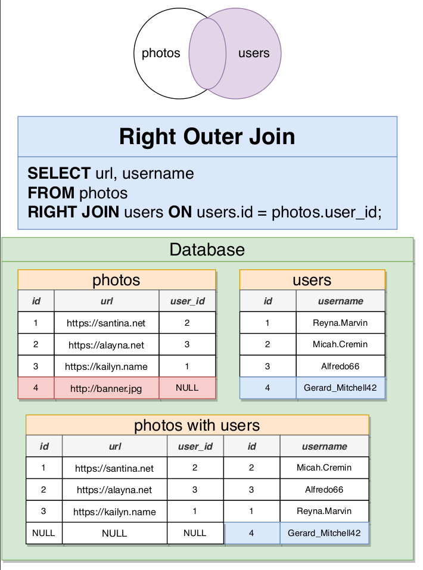

# Joins

prduces values by merging together rows from different tables

used when find data from multiple resources

# Aggregation

calculates a value from multiple rows like finding most, average, least.

# joins examples

CREATE TABLE comments(
id SERIAL PRIMARY KEY,
contents VARCHAR(200),
user_id INTEGER REFERENCES users(id),
photo_id INTEGER REFERENCES photos(id)
)

INSERT INTO comments(contents, user_id, photo_id)
VALUES
('fft djg test ftgh', 3, 1),
('fft djg test ftgh', 1, 2),
('fft djg test ftgh', 1, 3),
('fft djg test ftgh', 1, 3),
('fft djg test ftgh', 2, 1),
('fft djg test ftgh', 4, 4),

SELECT contents, username
FROM COMMENTS
JOIN users ON users.id = comments.user_id

SELECT contents, url
FROM comments
JOIN photos ON photos.id = comments.photo_id

in this example we can flip the comments and photos => FROM photos JOIN photos same result 

SELECT contents, url
FROM comments
JOIN photos ON photos.id = comments.photo_id

if the tables containes the same row like id => will get the ambiguous error message  

if there is a dublicated colmns name =>   select with photos.id  or  comments.id

SELECT contents, url, photos.id, 
FROM comments
JOIN photos ON photos.id = comments.photo_id

- naming:

SELECT contents, url, photos.id, 
FROM comments AS c                        => or just p with no AS
JOIN photos ON photos.id = c.photo_id

  
# inner join 

SELECT url, username 
FROM photos
JOIN users ON users.id = photos.user_id 

when using JOIN by itself is by defualt an inner join

can be JOIN users ON users.id = photos.user_id 

OR 

INNER JOIN users ON users.id = photos.user_id 

when there is no match in two tables the rwos will drop

