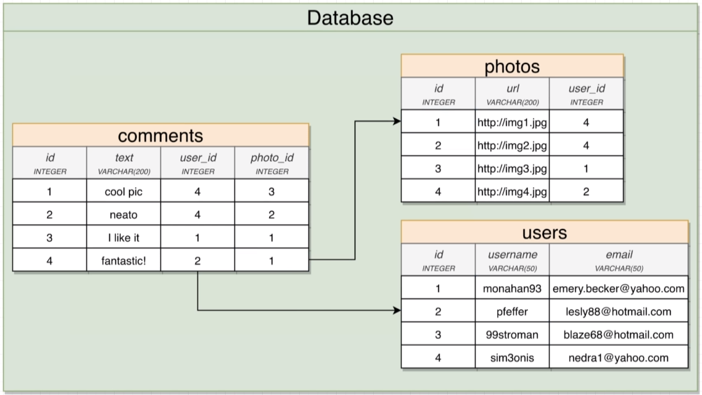

# one-to-many
A user has many photos  => has means one to many

 
# many-to-one
single or many images belong to one user

A photo has one user

A photo has many comments   =>   a comment has one photo

# one-to-one 

company has one CEO    =>   company <->  CEO   CEO has one company

student <->  desk

capital <-> country

# many-to-many

students <-> classes

players <-> football matches

movies <-> actors

# in table

the many side of the relationship gets the foriegn key column

