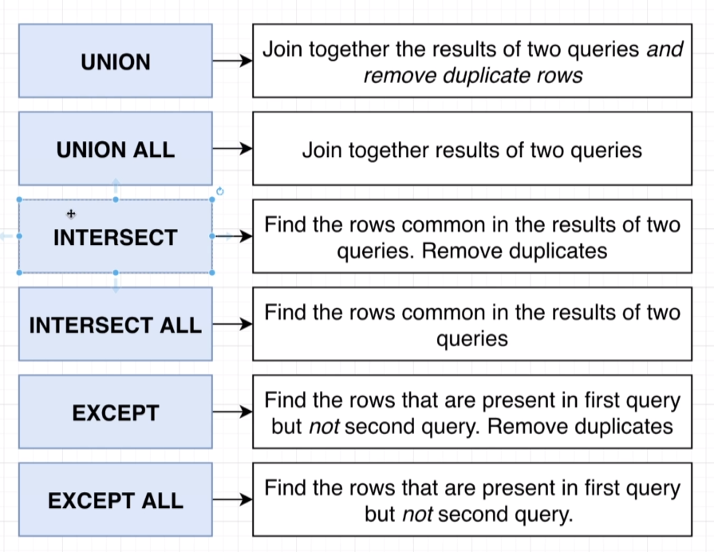

# union

find 4 products with the highest price and the 4 products with the highest price/weight ratio

(
SELECT _  
FROM products  
ORDER BY price DESC
LIMIT 4
)
UNION
(
SELECT _
FROM products
ORDER BY price / weight DESC
LIMIT 4
);

UNION:

take the result of one query and join it with the secound query

by default if there is a recourd that is same result it will remove it

if not add ALL it will not remove it

UNION ALL

# about union:

* INTERSECT:

(
  SELECT * 
  FROM products
  ORDER BY price DESC
  LIMIT 4
)

INTERSECT  => select ony the duplicates

(
SELECT *
FROM products 
ORDER BY price / weight DESC 
  LIMIT 4
)

* EXCEPT: 

Take the rows on lift side the first query and compare it with the secound query if there is a match it will remove it

(
  SELECT * 
  FROM products
  ORDER BY price DESC
  LIMIT 4
)

EXCEPT 

(
SELECT *
FROM products 
ORDER BY price / weight DESC 
  LIMIT 4
)

select manufacturer
from phones 
where price < 170 

UNION

select manufacturer 
from phones 
GROUP BY manufacturer 
HAVING COUNT(*) > 2